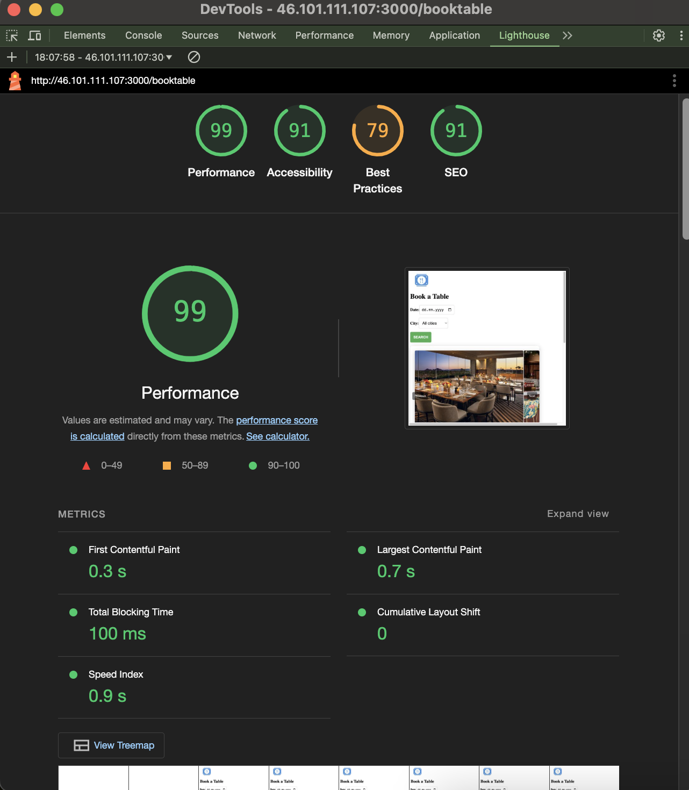

**Лабораторна робота № 1 Вибір ідеї**

- Сформувати команду (або індивідуально)

- Вибрати ідею

- Створити репозиторій

- Детально описати ідею в README.md

**Лабораторна робота № 2 Налаштування проекту та інструментів розробки**

- Створити пакети

- Вибрати стиль коду (Implemented in [.prettierrc.json](./.prettierrc.json)) 

- Налаштувати форматтер (the selected formatter is [prettier](./package.json#L20)) 
- Налаштувати лінтер або інший статичний аналізатор (the selected linter is [eslint](./.eslintrc.json))

- Налаштувати Git-hook на комміт та пуш. Перевіряти форматування, лінтер, тести(для початку завжди успішна команда), збірку\компіляцію проекту (фронт\TS\\...). (Implemented by husky package. The hook is here [`.husky/pre-commit`](./.husky/pre-commit)) 

**Лабораторна робота № 3 Розробка структури застосунку**

- Розділити додаток на основні компоненти/модулі, описати їх взаємодію відомими вам методами (наприклад діаграма компонентів ПЗ) (the component diagram: )

- Описати дані та їх зв’язки (наприклад ER діаграма) (the ER diagram: )

- Описати як дані оновлюються\змінюються\агрегуються на основі  ключових сценаріїв, які буде виконувати додаток

**Лабораторна робота № 4 Імплементація **** інтерактивного прототипу**

- Імплементувати основні сценарії використовуючи статичні дані (Без підключення до БД)

**Лабораторна робота № 5 Імплементація інтеграції з віддаленими джерелами даних**

- Інтегрувати віддалене джерело даних (Database is based on postgres engine with UI and API access through supabase application [supabase](https://supabase.com)) 

- Замінити статичні дані на реальну роботу з БД

**Лабораторна робота № 6 Тестування програмного забезпечення**

- Повністю покрити якийсь з модулів UNIT-тестами (module booking is covered with the unit test [`src/modules/booking.module.spec.ts`](./src/modules/booking.module.spec.ts)) 

- Налаштувати інтеграційні тести таким чином, щоб ви могли запустити всі залежні модулі перед тестами. (наприклад підключитись до бази, запустити хттп сервер і тестувати його роботу) (Integration test was implemented for booking module. [`src/modules/booking.module.int.spec.ts`](./src/modules/booking.module.int.spec.ts). It launches an express server to check the booking controller path `/booktable`.) 

- Налаштувати Е2Е тестування, що б охоплювало всі елементи системи (the E2E test has been developed in Playwright UI testing tool [`tests/booking.spec.ts`](./tests/booking.spec.ts)) 

- Провести мутаційне тестування та підготувати невеликий репорт про те як еффективно ви покрили код тестами, яка еффективність цих тестів, що ще варто зробити

**Лабораторна робота № 7 Розгортання програмного забезпечення**

- Налаштувати CI. При створенні нового ПР або коміта в ньому — необхідно перевірити код на відповідність обраному стилю(рекомендую prettier), відсутність помилок (linter\statyc analyzer eslint\tslint), те що він \\"збирається-билдиться\\", тести проходять(поки можна стаб який проходить завжди), а коміти відповідають обраному стилю описання (Рекомендую conventional commits). Github налаштувати так, щоб змерджити ПР можна було лише, якщо пройшов CI. (Github Actions is used as a main CI/CD tool. The workflow steps are described here: [`.github/workflows/node.js.yml`](./.github/workflows/node.js.yml)) 

- Налаштувати CD. При додаванні нових комітів в обрану гілку (наприклад мастер), необхідно автоматично розгортати нову версію ПО на виділеному Стейдж-сервері, або оновлювати її в маркеті. (deployment happens in case of successful application build and test (see the [`.github/workflows/node.js.yml`](./.github/workflows/node.js.yml)). pm2 is the node.js application manager. E2E tests are executed after successful deployment (see the file [`.github/workflows/playwright.yml`](./.github/workflows/playwright.yml))) 

- Сервіс доступний з інтернету (the deployment is fulfilled by self-hosted Github Actions runner. The application is available here [http://46.101.111.107:3000](http://46.101.111.107:3000)) 

Рекомендую Github Actions, так як він безкоштовний і вбудований в сам GitHub, який ми й так використовуємо.

**Лабораторна робота №8 Перформанс**

- Якщо є фронт: проаналізувати проект за допомогою <https://developers.google.com/web/tools/lighthouse/>, <https://developers.google.com/speed/pagespeed/insights/>, <https://github.com/GoogleChrome/lighthouse-ci>, о https\://web.dev/vitals/  та альтерантивних інтрументів, знайти проблеми

- Performance result was collected by means of Webpagetest.org [https://www.webpagetest.org/result/241222_AiDcX1_4P2/](https://www.webpagetest.org/result/241222_AiDcX1_4P2/). 
- Підготувати тест навантаження вашої системи який виконуватиме ті сценарії використання що покривають всі елементи системи та є найбільш типовими для звичайної роботи сервісу. Запустити сервер с профайлером, запустить тест навантаження та зібрати дані. Проаналізувати репорт. (implemented in [loadtest.sh](./loadtest.sh)) 
- Аналіз запитів до БД вбудованими інструментами (unfortunately, supabase does not have SQL profiler).

**Лабораторна робота №9 Виправляємо ботлнеки і вчимося виносити код з проекту**

- По результатам попередньої роботи визначаємо найбільш вразливий модуль в вашій системі.

Найбільш вразливий модуль у системі це Booking Service, бо має складну логіку, залежності від БД та є ключовим в роботі системи.

- Аналізуємо проблеми в його дизайні.

Логіка роботи з БД не абстрагована, код складно тестувати через жорстку прив'язку до Supabase, утилітарні функції такці як перевірка часу чи перекриття бронювання, повторюються в інших частинах системи.

- Абстрагуємо цей модуль від існуючої системи і виносимо його в окрему бібліотеку. Інтерфейси роботи з БД та іншими ресурсами що потребують ініціалізації передаємо як залежності при ініціалізації.

- Проводимо рефакторинг цього модуля при переносі.

- Переписуємо виділену лібу на TS.

[BookingService](./booking-library/src/BookingService.ts)
